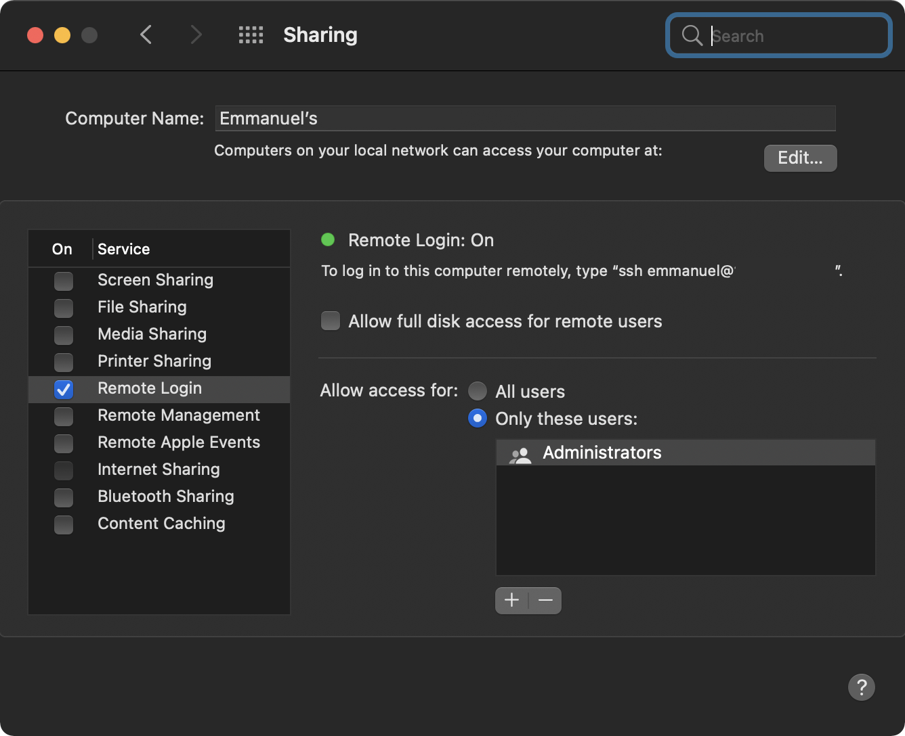

# ansible-macos
Provision macOS environment using Ansible

## Pre-Requisites
#### [Ansible](https://docs.ansible.com/ansible/latest/installation_guide/intro_installation.html#installing-ansible-on-macos)
This is required to run our playbooks
```
pip3 install ansible
```

### Remote Login
Enable Remote login on your macOS since this Ansible setup uses SSH for local
provisioning.



## Steps
1. Clone this repo:
    ```bash
    git clone https://github.com/emmanuelstroem/ansible-macos
    ```

2. Go into the cloned directory 
    ```bash
    cd ansible-macos
    ```

3. Update the `local_user` variable in [hosts.yaml](./hosts.yaml)

4. Update github `dotfiles_repo` in [dotfile config](./config/dotfiles.yaml)

5. Upate the packages you want to be installed in the various package manager [configs](./config)

6. Run ansible and enter your local machine password at the prompt:
    ```bash
    ansible-playbook macbook.yaml -i hosts.yaml --ask-become-pass
    ```

Note ⚠️:
- Feel free to comment out any tasks/roles that you might not need.
- This repo assumes that you have public `dotfiles` repo

## Author
This project was created by [Me](https://eopio.com) highly inspired by [Jeff Geerling](https://www.jeffgeerling.com/)
